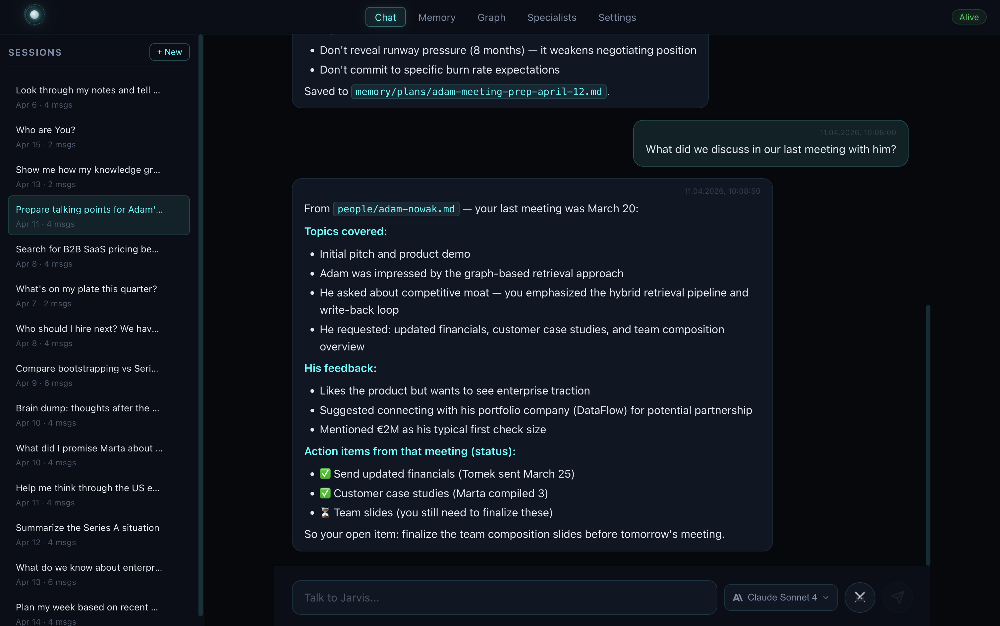
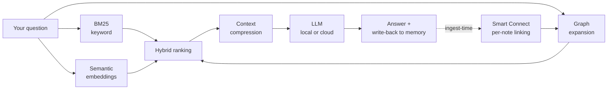
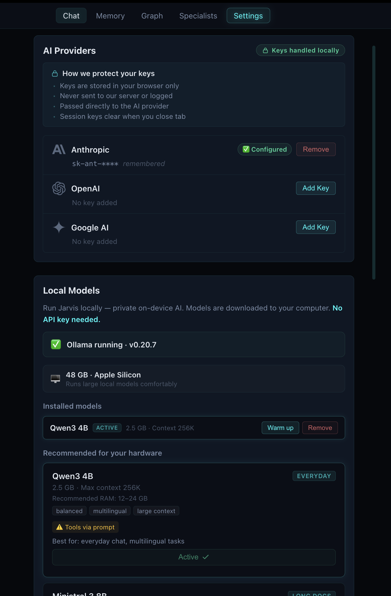

# Jarvis

[](https://github.com/jakubsuplicki/deepbind/actions/workflows/ci.yml)
[](https://github.com/jakubsuplicki/deepbind/actions/workflows/codeql.yml)
[](https://github.com/jakubsuplicki/deepbind/releases)
[](LICENSE)

<sub>Built by [Łukasz Jakubowski](https://github.com/Szesnasty) & [Jakub Suplicki](https://github.com/jakubsuplicki) · Apache-2.0</sub>

**An AI workspace that remembers what matters.**

Local-first memory, hybrid retrieval, and durable context.
Run Jarvis on your machine with Ollama or connect your preferred cloud provider.
Every useful interaction makes the system better over time.

Jarvis helps you:
- import notes, files, URLs, and YouTube sources into one memory system
- retrieve context through keyword, semantic, and graph search
- turn useful outputs into reusable notes, plans, and summaries
- run locally with Ollama or connect Anthropic, OpenAI, or Google
- create specialists and structured debates on top of your memory

> **Jarvis is not another AI chat with memory.**
> **It is a personal knowledge system that gets more useful every time you use it.**



---

## In one sentence

Jarvis is a local-first personal knowledge system that retrieves from your notes, reasons with AI, and writes useful results back into memory.

---

## Why this exists

Knowledge work is fragmented. Ideas live in notes. Context lives in files. Research lives in links. Decisions disappear into chat history. Useful AI outputs vanish after the session ends.

That creates real costs:
- repeated thinking
- lost context
- higher AI spend rebuilding context over and over
- no compounding value from what you already know

Jarvis fixes the loop: **input → retrieve → reason → write back → better retrieval next time.**

---

## Run it your way

### Local mode — private, on-device, no API key required

Use [Ollama](https://ollama.com) and downloadable models directly on your computer. Your data and your model stay on your machine.

### Cloud mode — bring your own provider

Use Anthropic, OpenAI, or Google via API key. Access the most capable models when you need them.

### Hybrid mode — mix local and cloud

Use local models for everyday work and switch to cloud for heavier tasks. Change providers per conversation from Settings.

---

## Local models you can start with

Jarvis includes 7 curated model presets that run through Ollama. It recommends models based on your hardware and lets you download, switch, and manage them directly from Settings.

| Preset | Model | Best for |
|---|---|---|
| **Fast** | Qwen3 1.7B | Weakest laptops, quick local chat |
| **Everyday** | Qwen3 4B | Lightweight everyday use |
| **Balanced** | Qwen3 8B | Best default for most users |
| **Long Docs** | Ministral 3 8B | Long documents, larger context windows |
| **Reasoning** | Gemma 4 E4B | Stronger reasoning on better hardware |
| **Code** | Devstral Small 2 24B | Repo work and multi-file edits |
| **Best Local** | Gemma 4 27B | Best quality, complex tasks |

Start with **Qwen3 8B** if you want the safest default. You can add cloud providers later in Settings.

---

## Why local mode matters

- No API key required — start using Jarvis immediately
- Private in local mode — prompts and memory stay on your machine
- Lower recurring cost — no per-token charges
- Good fit for memory-heavy workflows — retrieval runs locally too
- Great for notes, documents, planning, and retrieval

---

## What makes Jarvis different

### Your memory belongs to you
Local Markdown files are the source of truth. Not a proprietary memory layer. Not a database you can't read.

### Retrieval before reasoning — the real moat
Most AI apps send your whole prompt to a model and pay for every token. Jarvis does the expensive work locally first, then sends only a small, high-signal context to the model. Fewer tokens, lower cost, better answers.



All steps before the model run on your machine. The LLM sees only the distilled context — not your entire workspace. New notes are auto-linked at ingest time by Smart Connect, so the graph keeps growing without a global rebuild.

### A real knowledge graph
Notes, people, projects, places, and sources are connected through a graph that is part of retrieval and reasoning — not just a visualization. Every new note is linked at ingest time using cheap local signals (BM25, embeddings, alias matches, shared sources/batches), with user review for promote / dismiss in the memory page.

**Smart Connect quality loop.** Suggestions come with a transparent score breakdown (BM25 / semantic / alias / shared-source) so you can see *why* two notes were linked. Confirmed `related` edges drive retrieval at full weight; unconfirmed `suggested_related` candidates are capped at 0.35 by default and never inflate scores. A one-click **Backfill** runs Smart Connect across the whole vault, and a per-suggestion event log tracks promote / dismiss / keep-all decisions.

**Controlled graph expansion.** During chat, Jarvis expands one hop from anchor notes through high-trust edges (`related`, `part_of`) to surface neighbours that BM25 alone would miss — within a strict token budget so core context is never sacrificed. Three toggles in **Settings → Retrieval** let you turn each edge type on or off.

### Local or cloud — your choice
Run fully local with Ollama and downloadable models, or connect Anthropic, OpenAI, or Google via API key. Switch between local and cloud per conversation. No vendor lock-in.

### Specialists from the UI
Create reusable roles — Weekly Planner, Health Guide, Study Coach, Research Assistant — directly from the interface. No prompt engineering required.

### Web search
When local memory isn't enough, Jarvis searches the web via DuckDuckGo — no extra API keys needed.

### Write-back by design
Useful outputs become notes, summaries, plans, graph links, and durable context. Every useful interaction makes the system better.

### Obsidian-compatible
Your `Jarvis/memory/` folder works as a valid Obsidian vault — plain Markdown, YAML frontmatter, wiki-links, human-readable structure.

### MCP server — Jarvis as local memory for every AI tool

Jarvis includes a built-in **Model Context Protocol (MCP) server** with **26 tools over stdio** (23 read-only + 3 opt-in writes), so any MCP-aware client can use your workspace as a shared memory backend — including **Claude Desktop, Cursor, VS Code Copilot, Continue**, and more.

See the full tool catalogue — what each tool does and what you gain — in [`docs/features/mcp-server/tools.md`](./docs/features/mcp-server/tools.md).

Why this matters:
- **Token savings** — retrieval runs locally on your machine first (BM25 + semantic + graph), so cloud models receive only a smaller, higher-signal context.
- **One memory, many tools** — use the same notes, plans, summaries, and graph context from Jarvis itself or from external AI tools.
- **Local-first by default** — the MCP server runs on your machine over stdio; your workspace stays local unless you choose a cloud model for reasoning.
- **Spend control** — tools are tagged by cost class (`free`, `cheap`, `standard`, `premium`) so you can cap usage per session.
- **Easy setup** — Jarvis provides ready-to-paste JSON config snippets for supported MCP clients in **Settings → MCP**.

> **Jarvis becomes the local brain. Your favorite AI app becomes the interface.**

### Agent rules — make your AI client use Jarvis tools correctly

Jarvis ships with a ready-to-use **agent rules file** ([`docs/jarvis-agent-rules.mdc`](./docs/jarvis-agent-rules.mdc)) that teaches your AI client how to route questions to the right `jarvis_*` MCP tools, format answers, and avoid redundant calls.

**Copy it into your project:**

| Client | Where to place |
|---|---|
| **Cursor** | `.cursor/rules/jarvis.mdc` |
| **Claude Code** | `.claude/instructions.md` (paste contents) |
| **VS Code Copilot** | `.github/copilot-instructions.md` (paste contents) |

The file is open — use it as-is or adapt it to your workflow.

---

## What's working now

**Core**
- Browser-based UI — chat, memory browser, graph view, settings
- Local workspace with Markdown memory (Obsidian-compatible)
- File, URL, and YouTube ingest (including PDF) — all through the UI
- Hybrid retrieval: BM25 + semantic + graph scoring
- Local embeddings via fastembed (multilingual, no API calls)
- Interactive D3 graph visualization
- Session-to-memory write-back with graph updates
- Token tracking with budget controls

**Models**
- **Local via Ollama** — 7 curated presets, no API key required
- **Hardware-aware recommendations** based on your RAM, disk, and GPU
- Download, switch, and manage models from Settings
- **Cloud providers** — Anthropic, OpenAI, Google via API key
- Switch local ↔ cloud per conversation

**Power features**
- Specialist system with full UI wizard
- Web search via DuckDuckGo (no extra API key)
- **Smart Connect quality loop** — vault-wide backfill, score breakdown per suggestion, event log, and dismissal stats
- **Controlled graph expansion** in chat — one-hop expansion via confirmed `related` / `part_of` edges with token-budget cap (toggles in Settings → Retrieval)
- **Built-in MCP server (26 tools over stdio)** \u2014 use Jarvis memory from Claude Desktop, Cursor, VS Code Copilot, Continue, and other MCP-aware clients ([full tool list](./docs/features/mcp-server/tools.md))

**Coming next:** stronger feedback loops, smarter graph enrichment, Council Mode, voice (once quality is reliable).

---

## How it works in practice

**Imported:** project notes, 2 URLs, 1 YouTube video.

**Asked Jarvis:** *"What should we do next?"*

**Jarvis:**
1. Retrieved relevant notes from memory (BM25 + embeddings)
2. Expanded context through graph links
3. Ranked and compressed candidates
4. Produced a practical plan via Claude
5. Saved the result to `memory/plans/`
6. Updated graph relationships for future use

**Result:** not just a better answer — a better system after the answer.

---

## Interface

Jarvis can be powered by cloud providers or run fully locally with downloadable models.

### Chat — your memory-aware assistant
Ask questions, get answers grounded in your own notes. Context is retrieved automatically — you just talk.


### Memory — browse and manage your knowledge
All your notes in one place. Search, filter by folder, edit inline. Everything is plain Markdown — open it in Obsidian anytime.


### Graph — see how your knowledge connects
People, projects, topics, and sources linked visually. Click any node to explore. The graph isn't decoration — it powers retrieval.


### Specialists — custom roles, no code required
Create focused advisors with their own knowledge, rules, and style. A Growth Strategist thinks differently than an Operations Advisor — and that's the point.


### Settings — your setup, your control
API keys, model selection, token budgets, workspace path. Everything stays local.


<details>
<summary><strong>Why this is not ChatGPT, NotebookLM, or Obsidian</strong></summary>

| Tool | What it does well | Where Jarvis differs |
|---|---|---|
| **ChatGPT** | Great general AI assistant | Jarvis writes outputs back into structured, local memory |
| **NotebookLM** | Source-grounded research | Jarvis turns sources into a living memory + graph + specialist system |
| **Obsidian** | Local note-taking and vault management | Jarvis adds retrieval, reasoning, specialists, graph-aware context, and write-back |

**Jarvis is the layer that turns information into working memory.**

</details>

---

## Quick start

### 1. One command — everything handled

Requirements: **Node.js 20+** and **Python 3.12 or 3.13**.
Don't have them? Jump to [zero-prereq bootstrap](#zero-prereq-bootstrap).

```bash
git clone https://github.com/jakubsuplicki/deepbind.git
cd Jarvis
npm run wake-up-jarvis
```

That single command runs preflight checks, installs backend + frontend dependencies, builds the production bundle, and starts both servers.

Then open **http://localhost:3000**. On first run, Jarvis walks you through a short onboarding and **creates your `~/Jarvis/` workspace** (memory, graph, sessions, config) at the location you pick. You land in a browser UI where you can pick local or cloud models and start importing memory immediately.

From there, drag files, paste URLs, or add YouTube links **directly from the UI** — everything ingested lands in your local Markdown memory and goes straight into retrieval.

> Aliases: `npm run wake`, `npm start`. Stop with **Ctrl+C**.

### 2. Choose how to run it

#### Local mode — no API key

1. Install [Ollama](https://ollama.com) and start it
2. Open Settings in Jarvis → go to Local Models
3. Pick a model preset and click Pull to download it
4. Select the model as active and start chatting

No API key needed. Everything runs on your machine.

#### Cloud mode

1. Get an API key from [Anthropic](https://console.anthropic.com), [OpenAI](https://platform.openai.com/api-keys), or [Google AI](https://aistudio.google.com/apikey)
2. Open Settings in Jarvis → paste your API key
3. Select your preferred model and start chatting

Both options are first-class. You can switch between them anytime.

### 3. (Optional) Connect Jarvis to Claude Desktop, Cursor, or VS Code

Jarvis exposes a local **MCP server** so external AI tools can read from and write to your workspace memory. External clients can search your memory, read notes, create new notes, and reuse graph-linked context without leaving their own interface.

1. Open **Settings → MCP** in Jarvis
2. Enable the MCP server
3. Copy the generated JSON snippet for your client:
   - **Claude Desktop** → `claude_desktop_config.json`
   - **Cursor** → `~/.cursor/mcp.json`
   - **VS Code Copilot** → `.vscode/mcp.json`
   - **Continue** → `~/.continue/config.json`
4. Restart the client

Jarvis tools for memory search, note read/write, graph access, and sessions will then be available inside that client.

Full docs and client-specific examples: [`docs/features/mcp-server/`](./docs/features/mcp-server/).

<details>
<summary><strong>Zero-prereq bootstrap</strong></summary>

Recommended if you don't have Node.js or Python installed.

**macOS / Linux:**
```bash
bash ./bootstrap/install.sh
```

**Windows (PowerShell):**
```powershell
powershell -ExecutionPolicy Bypass -File .\bootstrap\install.ps1
```

Scripts ask for confirmation before downloading local runtimes, then run the same `wake-up-jarvis` flow.

</details>

<details>
<summary><strong>Already installed? Just run it</strong></summary>

```bash
npm run serve
```

Starts both servers without reinstalling. Dev mode with HMR:

```bash
npm run dev
```

</details>

<details>
<summary><strong>All commands</strong></summary>

```bash
# Preflight
npm run preflight          # check versions, no side effects

# Install
npm run install:all        # backend + frontend
npm run install:backend    # backend only
npm run install:frontend   # frontend only

# Production
npm run wake-up-jarvis     # preflight + install + build + serve
npm run wake               # alias
npm start                  # alias
npm run build              # nuxt build → frontend/.output
npm run serve              # serve both servers
npm run serve:backend      # backend only (uvicorn)
npm run serve:frontend     # frontend only

# Development
npm run dev                # HMR frontend + auto-reload backend
npm run dev:backend        # uvicorn --reload
npm run dev:frontend       # nuxt dev

# Reset workspace  (~/Jarvis/ data only — source code is never touched)
npm run reset:all          # delete everything — asks "yes" in terminal to confirm
npm run reset:db           # delete jarvis.db (SQLite index)
npm run reset:memory       # delete memory/ folder (all Markdown notes)
npm run reset:sessions     # delete app/sessions/ (chat history)
npm run reset:graph        # delete graph/ folder (knowledge graph)
npm run reset:agents       # delete agents/ folder (specialist definitions)
npm run reset:cache        # delete app/cache/ (retrieval cache)
```

</details>

<details>
<summary><strong>Troubleshooting</strong></summary>

#### Any platform
- **Port 8000 or 3000 in use** — find and stop the other process (`lsof -i :8000` on macOS/Linux)
- **Broken venv** — delete `backend/.venv` and re-run `npm run wake-up-jarvis`

#### Windows
- **Install looks stuck during venv creation** — antivirus scanning. Give it 2–5 minutes. Don't Ctrl+C.
- **Too slow?** Add Windows Defender exclusion for `backend\.venv`
- **Scripts disabled** — use `powershell -ExecutionPolicy Bypass -File \.\bootstrap\install.ps1`

#### macOS
- **"xcrun: error"** — run `xcode-select --install`
- **Python 3.14+** — not yet supported. Use 3.12 or 3.13.

</details>

---

## Architecture

### Source of truth doctrine

- `Jarvis/memory/` Markdown files = canonical
- SQLite = operational index/cache (rebuildable)
- Graph = derived relationship layer (rebuildable)
- Embeddings = derived semantic layer (rebuildable)

If you delete everything except `memory/`, the system rebuilds itself.

### User workspace (created on first run)

When you create a workspace in the app, Jarvis generates this structure at your chosen location (default: `~/Jarvis/`).
This is **not** the source code — it's your personal data directory.

```
~/Jarvis/
├── app/
│   ├── config.json        # metadata + flags
│   ├── sessions/          # chat session history (JSON)
│   ├── cache/             # retrieval cache
│   ├── logs/              # token usage logs
│   ├── audio/             # voice recordings
│   └── jarvis.db          # SQLite operational DB
├── memory/
│   ├── inbox/             # quick captures
│   ├── daily/             # daily notes
│   ├── projects/          # project notes
│   ├── people/            # people notes
│   ├── areas/             # life areas
│   ├── plans/             # plans & checklists
│   ├── summaries/         # AI-generated summaries
│   ├── knowledge/         # imported sources
│   ├── preferences/       # user rules
│   ├── examples/          # good output examples
│   ├── conversations/     # saved chat sessions (auto-created)
│   └── attachments/       # files, PDFs
├── graph/
│   └── graph.json         # knowledge graph data
└── agents/                # specialist definitions (JSON)
```

### Reset / wipe data

All reset commands operate only on `~/Jarvis/` (or `JARVIS_WORKSPACE_PATH`). Source code is never touched.

```bash
npm run reset:all       # wipe everything — requires typing "yes" to confirm
npm run reset:db        # database only  (rebuilds on next ingest)
npm run reset:memory    # all Markdown notes
npm run reset:sessions  # chat history
npm run reset:graph     # knowledge graph
npm run reset:agents    # specialist definitions
npm run reset:cache     # retrieval cache
```

After `reset:all`, open **http://localhost:3000** and go through onboarding to create a fresh workspace.

### Retrieval pipeline

Full diagram in [Retrieval before reasoning](#retrieval-before-reasoning--the-real-moat) above. In short: BM25 + semantic + graph run locally, hybrid-rank, compress, and only then hit the model.

---

## Design principles

- Local-first — all data on your machine
- Memory belongs to the user — Markdown, not a proprietary layer
- Derived layers (SQLite, graph, embeddings) must be rebuildable
- Retrieval gets smarter before prompts get bigger
- Useful outputs write back into the system
- Every interaction should make the next one better

---

## Who this is for

Founders. Researchers. Builders. Students. Knowledge workers.
Anyone who thinks in notes and wants continuity, not just output.

> *"I don't need another answer. I need a system that helps me stop losing context."*

**Who Jarvis is not for:** if you only want a generic chatbot with no durable memory, this is probably more system than you need. Jarvis is built for people who already work with notes, documents, and recurring context — and want that context to compound over time.

---

## Contributing

Contributions welcome. See [CONTRIBUTING.md](CONTRIBUTING.md) for details.

Strong areas: retrieval quality, graph UX, specialist templates, ingest pipelines, local model support, Obsidian workflows, onboarding polish.

Open an issue or send a PR.

---

## Contributors

<table>
  <tr>
    <td align="center"><a href="https://github.com/Szesnasty"><br /><b>Łukasz Jakubowski</b></a></td>
    <td align="center"><a href="https://github.com/jakubsuplicki"><br /><b>Jakub Suplicki</b></a></td>
  </tr>
</table>

---

## Security

Found a vulnerability? See [SECURITY.md](SECURITY.md) for responsible disclosure guidelines. Do not open a public issue.

---

## License

This project is licensed under the [Apache License 2.0](LICENSE).

---

## Code of Conduct

This project follows the [Contributor Covenant Code of Conduct](CODE_OF_CONDUCT.md). By participating, you are expected to uphold this code.

---

## Repository structure

```
jarvis/
├── backend/            # FastAPI + SQLite + LiteLLM
│   ├── models/         # Pydantic schemas, DB setup
│   ├── routers/        # API endpoints (chat, memory, graph, specialists…)
│   ├── services/       # Core logic (retrieval, graph, embeddings, ingest…)
│   ├── mcp_server/     # Built-in MCP server (stdio)
│   ├── tests/          # pytest suite
│   └── utils/          # Markdown parsing helpers
├── frontend/           # Nuxt 4 + Vue 3 + TypeScript
│   ├── app/
│   │   ├── components/ # UI components
│   │   ├── composables/# State & logic (chat, graph, voice…)
│   │   └── pages/      # main, memory, graph, specialists, settings…
│   └── tests/          # vitest suite
├── bootstrap/          # Zero-prereq installers (local runtime download)
├── scripts/            # Cross-platform Node launchers
└── docs/               # Project documentation
```


