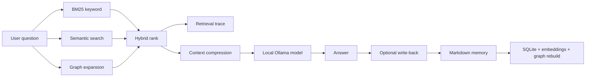

# DeepFilesAI

[](https://github.com/jakubsuplicki/deepbind/actions/workflows/ci.yml)
[](https://github.com/jakubsuplicki/deepbind/actions/workflows/codeql.yml)
[](LICENSE)

<sub>Codename: Jarvis · Open-source, Apache-2.0 licensed · originally developed by Zen Zero Pty Ltd</sub>

**A pure-local AI workspace that remembers what matters.**

DeepFilesAI is a local-first personal knowledge, planning, and memory system. It runs as a desktop app with a local web UI, a local Python sidecar, a bundled Ollama runtime, and a Markdown workspace that stays on the user's machine.

V1 is intentionally **pure local**:

- no cloud LLM providers
- no API-key UI
- no LiteLLM
- no web search
- no telemetry SDKs
- no vendor-hosted backend

Model downloads can still contact the Ollama registry when the user pulls a local model. Inference, retrieval, memory, graph building, session history, and write-back all run locally.


---

## In One Sentence

DeepFilesAI retrieves from your local notes and documents, reasons with a local model, and writes useful outputs back into durable Markdown memory.

---

## Current Product Shape

The current source of truth is:

- [Project overview](./docs/overview.md)
- [ADR 002 — Pure local product shape](./docs/architecture/decisions/002-pure-local-product-shape.md)
- [ADR 003 — Tauri shell + sidecars](./docs/architecture/decisions/003-desktop-distribution-tauri-and-sidecars.md)
- [ADR 015 — Single-target local-only stack](./docs/architecture/decisions/015-single-target-local-only-stack.md)
- [ADR 020 — Web search dropped from v1](./docs/architecture/decisions/020-web-search-dropped-v1.md)

Older planning docs may still mention Claude, Anthropic, OpenAI, Google, web search, browser-only operation, or cloud/provider switching. Those references are historical pre-pivot material unless an accepted ADR says otherwise.

---

## What It Does

DeepFilesAI helps you:

- import notes, files, PDFs, URLs, YouTube transcripts, and Jira exports into local memory
- search memory with BM25 keyword search, embeddings, reranking, and graph expansion
- split long documents into sections so retrieval can cite the right part
- build and inspect a local knowledge graph
- save useful chat outputs back into Markdown notes, plans, summaries, and sessions
- create specialists with their own rules and knowledge
- expose the same local memory to MCP clients such as Claude Desktop, Cursor, VS Code Copilot, and Continue

The product is not trying to be a generic chatbot. It is a local knowledge system whose value compounds as memory improves.

---

## Architecture

```text
DeepFilesAI.app
├─ Tauri shell (Rust)
│  ├─ starts the Nuxt webview immediately
│  ├─ spawns bundled Ollama on a private localhost port
│  ├─ spawns the frozen FastAPI sidecar
│  └─ supervises child process shutdown
│
├─ Nuxt 4 / Vue frontend
│  ├─ chat
│  ├─ memory browser
│  ├─ graph view
│  ├─ specialists
│  └─ settings
│
├─ FastAPI sidecar (Python, PyInstaller)
│  ├─ retrieval and context building
│  ├─ Ollama dispatch
│  ├─ ingest and parsing
│  ├─ graph/index maintenance
│  ├─ MCP server entrypoint
│  └─ local file I/O
│
└─ Local workspace
   ├─ memory/*.md      canonical user knowledge
   ├─ app/jarvis.db    rebuildable SQLite index/cache
   ├─ graph/graph.json rebuildable graph
   └─ agents/*.json    specialists
```

### Why This Shape

The product is designed for compliance-sensitive knowledge work where "trust us, the cloud path is disabled" is not a good enough answer. The local-only claim is structural: the v1 app does not ship cloud LLM SDKs or provider routes.

The source-of-truth rule is equally important: Markdown is canonical. SQLite, embeddings, and graph files are acceleration layers that can be rebuilt.

---

## Retrieval Before Reasoning

DeepFilesAI does not throw the whole workspace into the model. It searches locally first, compresses the result, then sends a smaller context to the local model.



This design keeps the model focused, reduces context bloat, and makes answers inspectable through retrieval traces.

---

## Local Models

DeepFilesAI uses Ollama for chat models. The desktop app bundles the Ollama runtime and runs it on a private localhost port so it does not depend on a user-installed Ollama service.

The catalog is hardware-aware. Smaller machines start with lighter Qwen3 models; stronger machines can pull larger Qwen3 / Granite / gpt-oss entries where supported.

The first-run flow pulls a recommended model, probes whether it behaves correctly for chat/tool use, then keeps a fallback model available for memory-pressure downgrade.

See [Local Models](./docs/features/local-models.md) and [ADR 005](./docs/architecture/decisions/005-hardware-tiered-model-stack-and-first-run-policy.md).

---

## Key Features

### Local Markdown Memory

The workspace is an Obsidian-compatible Markdown vault. User knowledge lives in readable files, not a proprietary database.

### Hybrid Retrieval

Retrieval combines keyword search, local embeddings, reranking, graph neighbours, section classification, and context compression.

### Knowledge Graph

Notes, documents, sections, entities, Jira issues, sources, and relationships form a local graph used for retrieval and visualization.

### Smart Connect

New notes can be linked to related notes using cheap local signals. Suggested edges can be reviewed, promoted, dismissed, and audited with score breakdowns.

### Document Intelligence

Large PDFs and long documents are split into section notes, classified, indexed, and grouped so retrieval can target the relevant section instead of treating the document as one giant blob.

### Specialists

Specialists are reusable local roles with their own instructions and knowledge boundaries. They sit on top of the same local retrieval and memory system.

### MCP Server

DeepFilesAI includes a local stdio MCP server so external AI tools can use the same memory backend. See [MCP Server Tools](./docs/features/mcp-server/tools.md).

### Offline Licensing (reference implementation)

The repo includes a self-contained offline-licensing subsystem: signed
`.deepfileslic` entitlement files verified locally against an embedded public
key, with no vendor admin portal required. It ships as a reference
implementation of local, server-free license verification — it is not wired to
any live license server, and the Apache 2.0 license above governs the source itself.
See [ADR 019](./docs/architecture/decisions/019-licensing-operational-model.md).

---

## What Is Not In V1

- No Anthropic/OpenAI/Google provider selection
- No cloud API-key storage
- No web-search fallback
- No hosted sync or shared team server
- No cloud telemetry
- No mobile app
- No multi-user shared knowledge mesh

Some of these are discussed in research or future-version docs. They are not part of the v1 product shape.

---

## Developer Quick Start

Requirements:

- Node.js 20+
- npm 9+
- Python 3.12 or 3.13

The repo also supports a local standalone Python runtime downloaded by the install scripts.

```bash
npm run preflight
npm run wake-up-jarvis
```

Then open:

```text
http://localhost:3000
```

Useful aliases:

```bash
npm run wake
npm start
```

Stop the dev/browser process with `Ctrl+C`.

### Development

```bash
npm run dev
npm run dev:backend
npm run dev:frontend
```

### Tests

```bash
cd backend
pytest

cd ../frontend
npm test
```

### Workspace Reset

These commands operate on the user workspace, not the source tree.

```bash
npm run reset:all
npm run reset:db
npm run reset:memory
npm run reset:sessions
npm run reset:graph
npm run reset:agents
npm run reset:cache
```

---

## Desktop Release Build

The macOS release path produces a signed, notarized, stapled `DeepFilesAI.app` and `.dmg` for Apple Silicon.

Start here:

- [macOS release build runbook](./docs/runbooks/release-build-macos.md)
- [G4b6 cold-launch verification](./docs/runbooks/g4b6-cold-launch-verification.md)

The release build verifies that cloud SDKs do not leak into the bundle and that the Info.plist capabilities match the local-only contract.

---

## User Workspace

Default path:

```text
~/Jarvis/
```

Structure:

```text
~/Jarvis/
├── app/
│   ├── config.json
│   ├── sessions/
│   ├── cache/
│   ├── logs/
│   └── jarvis.db
├── memory/
│   ├── inbox/
│   ├── daily/
│   ├── projects/
│   ├── people/
│   ├── areas/
│   ├── plans/
│   ├── summaries/
│   ├── knowledge/
│   ├── preferences/
│   ├── examples/
│   ├── conversations/
│   └── attachments/
├── graph/
│   └── graph.json
└── agents/
```

If `memory/` survives, the operational layers can be rebuilt.

---

## Repository Structure

```text
deepbind/
├── backend/      FastAPI sidecar, retrieval, ingest, graph, MCP, tests
├── frontend/     Nuxt 4 / Vue UI and frontend tests
├── desktop/      Tauri shell, sidecar build, release scripts
├── bootstrap/    local setup helpers
├── scripts/      root Node launchers
├── docs/         ADRs, feature docs, runbooks, research
└── samples/      developer-only fixtures
```

---

## License

DeepFilesAI is open-source software released under the [Apache License 2.0](./LICENSE). It was originally developed by Zen Zero Pty Ltd.

Bundled third-party components retain their own licenses. See [Third-Party Notices](./docs/THIRD-PARTY-NOTICES.md).
